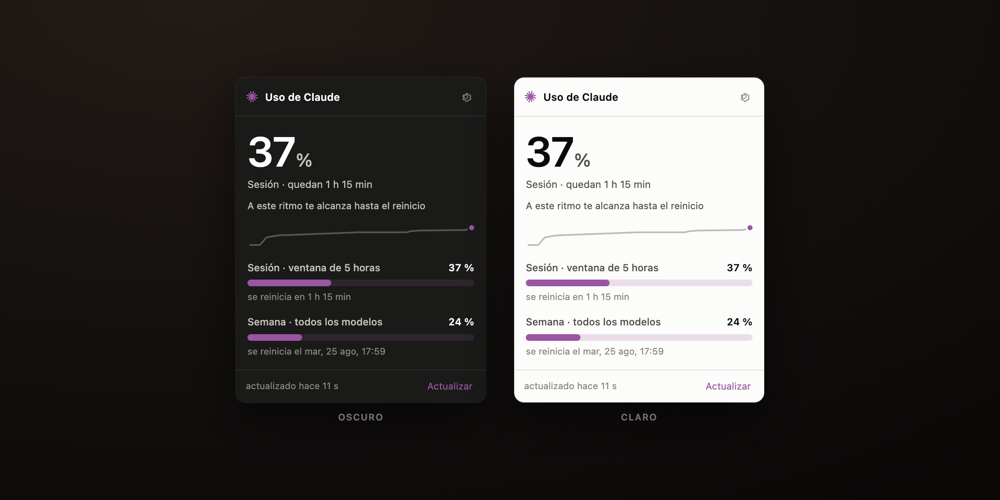

Trabajo a diario con Claude Code y siempre tenía la misma duda incómoda:
¿cuánto me queda antes de agotar el límite? La respuesta llegaba tarde, cuando
ya me había quedado sin sesión a mitad de algo.



**[Claude Usage Bar](https://github.com/RagnArUCi/claude-usage-bar)** pone el
porcentaje donde siempre lo ves: el asterisco de Claude con la cifra al lado en
la barra de menú de macOS, o un icono con el número dentro —estilo indicador de
batería— en la bandeja de Windows y Linux.

Lee la sesión que Claude Code ya guardó en tu máquina. No hay que pegar ningún
token en ningún sitio; de hecho no existe un campo donde pegarlo.

## La pregunta que de verdad importa

El porcentaje solo no sirve de mucho. Lo que quieres saber a media tarde es si
te llega hasta el reinicio.

> A este ritmo te alcanza hasta el reinicio

Eso sale de una regresión sobre tu historial. Y ahí está el detalle que más me
enseñó: **el tramo que se mide tiene que depender de la duración de la
ventana**. Para la sesión de cinco horas, la última hora describe bien lo que
estás haciendo. Para la ventana semanal, no: extrapolar un ritmo horario a
siete días asume que nadie duerme, y la primera versión te anunciaba muy seria
que te quedabas sin cuota mañana por la mañana. Ahora la semanal se mide sobre
48 horas, que ya incluyen noches y pausas.

## El 429 no era lo que parecía

La primera versión fallaba de vez en cuando con un error 429. La tentación era
cambiar de método de autenticación —hay apps que usan la cookie de la web en
lugar del token— pero la causa no era la credencial: **era el ritmo**.

Consultaba cada 60 segundos sin pensar. Unas 1.440 peticiones diarias, con el
mismo token que usa Claude Code, así que se sumaban a las suyas.

La solución fue dejar de preguntar a lo tonto. El porcentaje solo se mueve
cuando de verdad estás usando Claude, así que la app vigila la actividad local
del CLI y solo entonces consulta seguido; en reposo espera cinco minutos. De
~1.440 peticiones a ~290.

Y lo más importante: **guarda el último dato bueno**. Un fallo transitorio ya
no te muestra un error, te sigue mostrando tu porcentaje con una nota discreta
de "no reciente". Esa es la diferencia entre una app que parece fiable y una que
lo es.

## Dos detalles que no se ven pero se notan

**El color lo pone tu sistema.** Los medidores usan tu acento, y como ese color
lo eliges tú y puede ser cualquiera, la app mide el contraste real y ajusta la
luminosidad hasta 3:1 conservando el matiz. Un amarillo claro sobre fondo claro
tiene contraste 1,05: invisible. Ahora se convierte en un oliva legible que
sigue siendo tu amarillo.

**No hay ni una imagen en el repositorio.** El icono de la app y los de la
bandeja se dibujan por código, con un codificador PNG propio de unas cincuenta
líneas. La app no tiene dependencias de runtime: ni una.

## Probarlo

```bash
curl -fsSL https://raw.githubusercontent.com/RagnArUCi/claude-usage-bar/main/scripts/install.sh | sh
```

Instaladores para macOS (Apple Silicon e Intel), Windows y Linux en
[Releases](https://github.com/RagnArUCi/claude-usage-bar/releases). MIT.

---

*Si además usas Gemini o Kiro, existe
[ai-usage-bar](https://github.com/RagnArUCi/ai-usage-bar): el mismo motor con
una arquitectura de proveedores como módulos, y los tres en la misma barra.*
